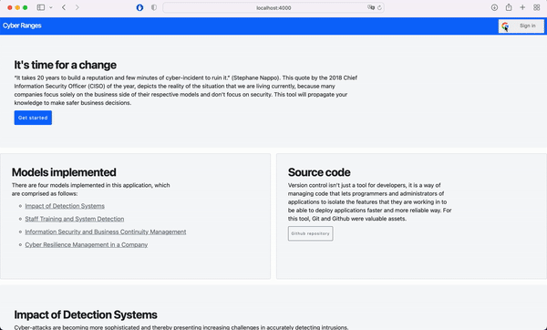

# README.md

A web app developed to facilitate the process of making decisions in the Cybersecurity spectrum from a management standpoint.

“It takes 20 years to build a reputation and few minutes of cyber-incident to ruin it.” (Stephane Nappo). This quote by the 2018 Chief Information Security Officer (CISO) of the year, depicts the reality of the situation that we are living currently, because many companies focus solely on the business side of their respective models and don’t focus on security.

## 1. Instalation

1. Clone the repository: `git clone git@github.com:juancarlosagreda/cyber-ranges.git`
2. Install dependencies: `yarn`
3. Ask for development permissions and dotfiles.
4. Initialize database: `firebase init`
5. Initialize app for local development: `yarn dev`

### 2. Objectives

There are four main objectives comprised on this project.

The first objective is to transfer the dynamic models that have previously been developed from Vensim to InsightMaker. The importance of this objective lies in the portability of the models, since the InsightMaker models can be altered and run dynamically through an API, written in Javascript by InsightMaker, meaning that the models can be able to adapt better to the situation of any company with an easy-to-use interface.

The second objective is to develop a game-like web application for the users to input the company data. This development will transfer the importance of cibersecurity by allowing users to make tangible inputs into the game (investments into certain aspects of the company), and recieving feedback on the impact of the investments as monetary values potentially saved by making these investments.

The third objective is to insist that the human factor in an organization nowadays is a no-brainer. Since the section in the world of cibersecurity that is covered in this project is mainly the human-side and not the technical-side, it is important to highlight the importance of the human element that is implied into the vulnerability of every system.

The fourth objective is to impulse internationalization through this project, since globalization is a big factor that is exponentially growing, especially in the IT industry. This fourth objective will be focalized around the best practices and industry standards to carry through this types of projects.

## 3. Functionalities

App Function: This application will be used like  a game to make decisions about Cybersecurity and see the results in a 12 week period to observe and analyze results.

User profile: This application is mean to be used by high-level excecutives who make decisions on their respective companie's investment split, to help them gauge where to make smart investments based on their needs and assets in the Cybersecurity spectrum.

Constraints: Because there is only one developer for this project at the moment, we do have a set of constraints for this project given the insighmaker technologies that are deprecated.

Database functions: The database that it is utilized, Google Firestore, is cloud-based, and it provides many tools for our software development team. The main database functions that will be implemented in this project are CRUD operations.

## 4. Functional requirements

This section contains all of the functional requirements of the system. It gives a detailed description of the system and all its features.

### 1. User login (ID:FR1)

In order to play the game, the user has to be logged in with their Google Account. After the user has successfully logged in, a session cookie will be created for 30 minutes and will be redirected to the Dashboard page where they can visualize their latest run or the default dashboard.

### 2. View source code (ID:FR2)

Transparency in this application is important, so in the landing page, the user has a link to view the source code and respective documentation.

### 3. View models implemented (ID:FR3)

Transparency in this application is important, so in the landing page, the user has a link to view the models implemented as well as their respective descriptions.

### 4. View latest results (ID:FR4)

When the user has logged in, the page will redirect to the dashboard, where the latest results table will be on display as well as the date of the simulation.

### 5. Modify model inputs (ID:FR5)

When a new game starts, the user will see five range inputs to modify the simulation. Each input represents a percentage of the total money they have to invest in. If the user invests more than the total money, they will not be able to run the simulation.

### 6. Simulate models (ID:FR6)

The user will be able to simulate models multiple times in one run, but only the last simulation will count. This will let the user decide which distribution will suit their company needs better.

## 5. Non-Functional requirements

This section contains all of the non-functional requirements of the system. It gives a detailed description of the system and all its features.

### 1. High availability (ID:NFR1)

The system has to be highly available, since the point of the application is to be able to facilitate making decisions.

### 2. High consistency (ID:NFR2)

High consitency is key, since the users will make decisions based on the results of this application.

### 3. Global (eventually) (ID:NFR3)

We want to raise awareness about cybersecurity, so it makes sense that we want a wide range of users all around the world.

## 6. Storyboard

## 7. System Design

