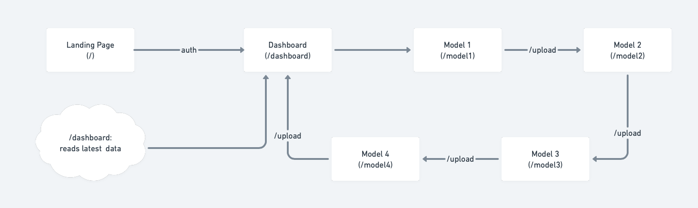

# README.md

A web app developed to facilitate the process of making decisions in the Cybersecurity spectrum from a management standpoint.

“It takes 20 years to build a reputation and few minutes of cyber-incident to ruin it.” (Stephane Nappo). This quote by the 2018 Chief Information Security Officer (CISO) of the year, depicts the reality of the situation that we are living currently, because many companies focus solely on the business side of their respective models and don’t focus on security.

### 1. Instalation

1. Clone the repository: `git clone git@github.com:juancarlosagreda/cyber-ranges.git`
2. Install dependencies: `yarn`
3. Ask for development permissions and dotfiles.
4. Initialize database: `firebase init`
5. Initialize app for local development: `yarn dev`

### 2. Objectives

There are four main objectives comprised on this project.

The first objective is to transfer the dynamic models that have previously been developed from Vensim to InsightMaker. The importance of this objective lies in the portability of the models, since the InsightMaker models can be altered and run dynamically through an API, written in Javascript by InsightMaker, meaning that the models can be able to adapt better to the situation of any company with an easy-to-use interface.

The second objective is to develop a game-like web application for the users to input the company data. This development will transfer the importance of cibersecurity by allowing users to make tangible inputs into the game (investments into certain aspects of the company), and recieving feedback on the impact of the investments as monetary values potentially saved by making these investments.

The third objective is to insist that the human factor in an organization nowadays is a no-brainer. Since the section in the world of cibersecurity that is covered in this project is mainly the human-side and not the technical-side, it is important to highlight the importance of the human element that is implied into the vulnerability of every system.

The fourth objective is to impulse internationalization through this project, since globalization is a big factor that is exponentially growing, especially in the IT industry. This fourth objective will be focalized around the best practices and industry standards to carry through this types of projects.

### 3. Functionalities

App Function: This application will be used like  a game to make decisions about Cybersecurity and see the results in a 12 week period to observe and analyze results.

User profile: This application is mean to be used by high-level excecutives who make decisions on their respective companie's investment split, to help them gauge where to make smart investments based on their needs and assets in the Cybersecurity spectrum.

Constraints: Because there is only one developer for this project at the moment, we do have a set of constraints for this project given the insighmaker technologies that are deprecated.

Database functions: The database that it is utilized, Google Firestore, is cloud-based, and it provides many tools for our software development team. The main database functions that will be implemented in this project are CRUD operations.

### 4. Functional requirements

### 5. Non-Functional requirements

### 6. Storyboard

### 7. System Design

